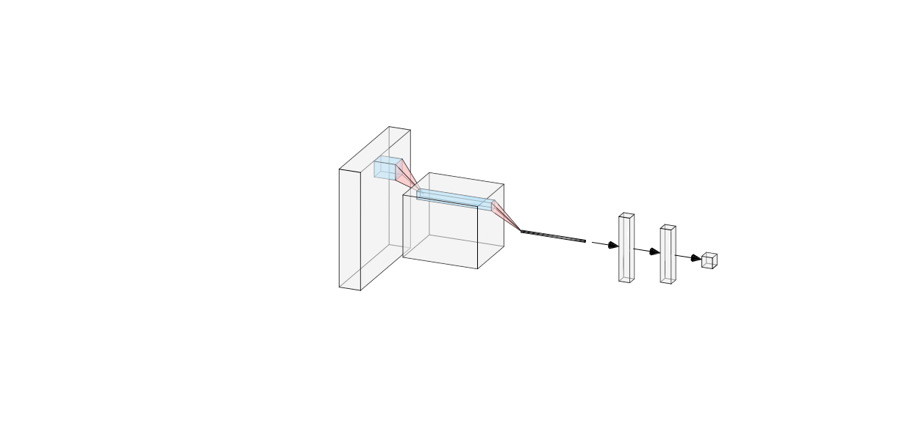

# Model Structure

## Aarchitecture Schematics

    Schematic of the machine learning model structure*

> **TODO** 
> - Add tensor dimensions
> - Need modification as this graph implies 2D Convolution layers (for image)

\* Online Tool used to generate the graph: http://alexlenail.me/NN-SVG/LeNet.html

## Layers Summary

<pre>
_________________________________________________________________
Layer (type)                 Output Shape              Param #   
=================================================================
Conv1 (Conv1D)               (None, 1991, 128)         5248      
_________________________________________________________________
spatial_dropout1d_23 (Spatia (None, 1991, 128)         0         
_________________________________________________________________
max_pooling1d_12 (MaxPooling (None, 9, 128)            0         
_________________________________________________________________
Conv2 (Conv1D)               (None, 1, 64)             73792     
_________________________________________________________________
spatial_dropout1d_24 (Spatia (None, 1, 64)             0         
_________________________________________________________________
Flatten1 (Flatten)           (None, 64)                0         
_________________________________________________________________
Dense1 (Dense)               (None, 64)                4160      
_________________________________________________________________
Dense2 (Dense)               (None, 32)                2080      
_________________________________________________________________
Dense4 (Dense)               (None, 1)                 33        
=================================================================
Total params: 85,313
Trainable params: 85,313
Non-trainable params: 0
_________________________________________________________________
</pre>

\* None is a placeholder for the samples(genes) dimension
